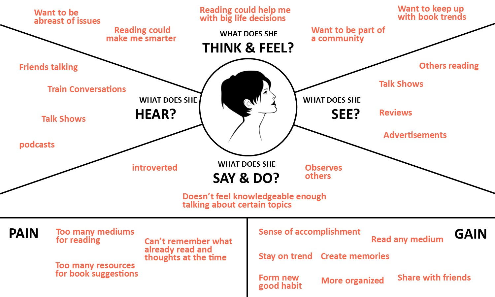
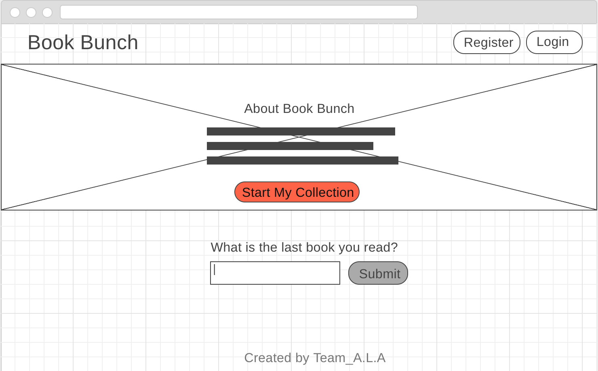
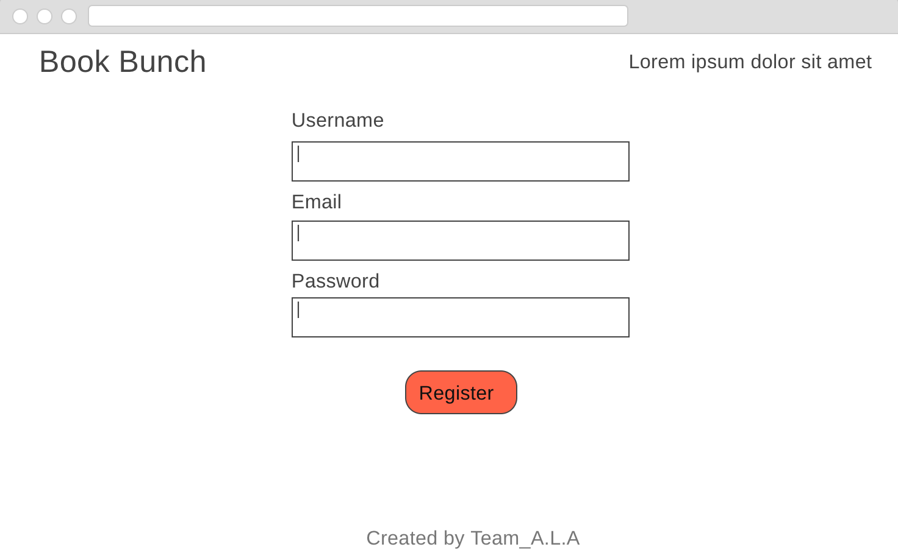
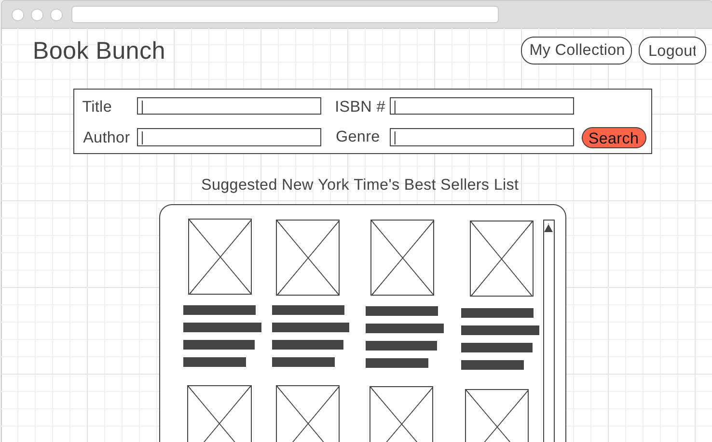
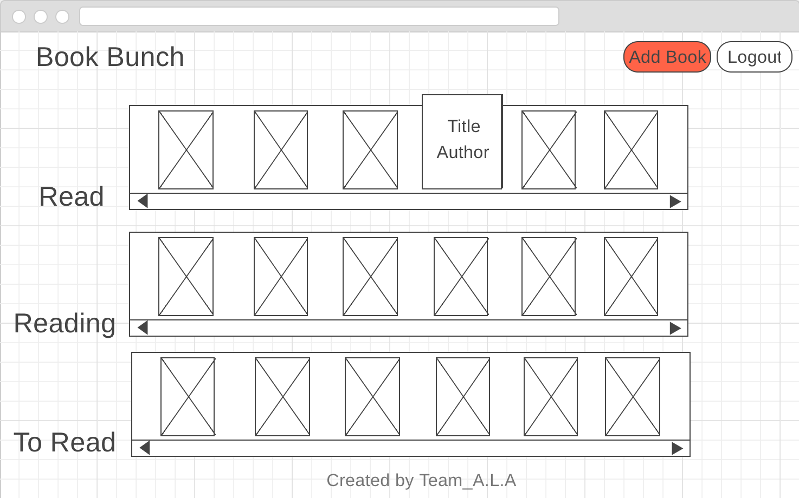
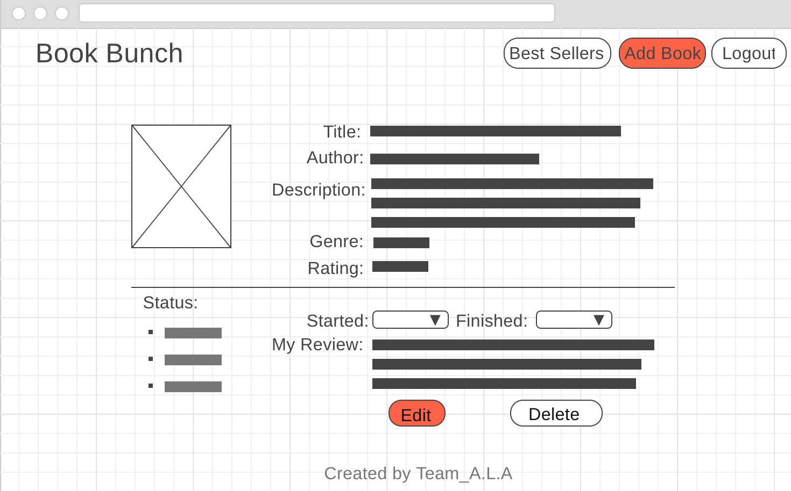

*** Team ALA - Ahsan, Lisa, Aliaksei / 5.23.17 ***

# Book Bunch

## What is Book Bunch?

Contrary to popular belief, Millennials read more than older generations do—and more than the last generation did at the same age! An [article](https://www.theatlantic.com/technology/archive/2014/09/millennials-are-out-reading-older-generations/379934/) about the 2014 Pew Research Center report said that "Deeper connections with [books] are also often associated with key life moments such as having a child, seeking a job, being a student, and going through a situation in which research and data can help inform a decision." Soooo...basically all of your 20's! Everything on the internet is interconnected. What better place to have a list of the books you've found on forbes, ESPN, instagram, in a youtube video, amazon etc. that can help you tackle those life event than Book Bunch? 

Book Bunch is a virtual bookshelf CRUD app where users can: 
- View books on a user profile archived in the database
- Add books to the databse(by searching the google books api)
- Edit books in the database, update the status of the book (read, reading, to-read), and add a review of the book
- And delete books from the database

## Technologies To Be Used
- Express backend
- Postgres/Pg-Promise
- React
- Bcrypt/sessions (for user authentication)
- Git/Github.com
- CSS3
- Heroku web hosting

## Empathy Map

## Wireframes

#### Landing on home page

#### Registration Form

#### Add Book/Search Page

#### User Collection Page

#### Individual Book Page

## Initial thoughts on database structure

Users.

| id | Username   | Email   | Password    | 
|--- |:----------:|:-------:| -----------:|
| 1  | 'username' | 'email' | 'password'  | 
| 2  | 'username' | 'email' | 'password'  | 
| 3  | 'username' | 'email' | 'password'  | 

Books.

| id | Title   | Author   | Genre  |   ISBN  |Description   | Rating | Image Url |  
|--- |:-------:|:--------:|:------:|:-------:|:------------:|:------:| ---------:| 
| 1  | 'title' | 'author' | 'genre'|  num    |'description' | num    | 'url'     |
| 2  | 'title' | 'author' | 'genre'|  num    |'description' | num    | 'url'     |
| 3  | 'title' | 'author' | 'genre'|  num    |'description' | num    | 'url'     |

Users_Books table.

| id | user_ref_id | book_ref_id | status   | review      | date_started  | date_finished | 
|--- |-------------:|:-----------:| :-------:|:----------:|:-------------:| -------------:|
| 1  |     1        |     1       |'Reading' | 'Loved it' | 'YYYY-MM-DD'  | 'YYYY-MM-DD'  |
| 2  |     2        |     1       | 'Read'   | 'Hated it' | 'YYYY-MM-DD'  | 'YYYY-MM-DD'  |
| 3  |     1        |     2       | 'To-Read'| 'Loved it' | 'YYYY-MM-DD'  | 'YYYY-MM-DD'  |

## Advanced Features
- notes section on individual book page
- embedded/popup book preview
- Link to amazon to purchase books
- Ability to scan isbn barcode on mobile
- Google Chrome extension for easy access to our app from anywhere the user may be surfing in the internet.

## Links and Resources
- https://developers.google.com/books/
- https://developers.google.com/books/docs/v1/using#PerformingSearch
- http://developer.nytimes.com/books_api.json#/Documentation/GET/lists.%7Bformat%7D
- https://developers.google.com/books/docs/preview-wizard
- https://react-bootstrap.github.io/
- https://www.nytimes.com/books/best-sellers/?mcubz=0
- https://www.forbes.com/sites/neilhowe/2017/01/16/millennials-a-generation-of-page-turners/#255cd1fa1978
- http://www.androidauthority.com/best-ebook-ereader-apps-for-android-170696/

- https://git.generalassemb.ly/nyc-wdi-ada/ada-with-jointables